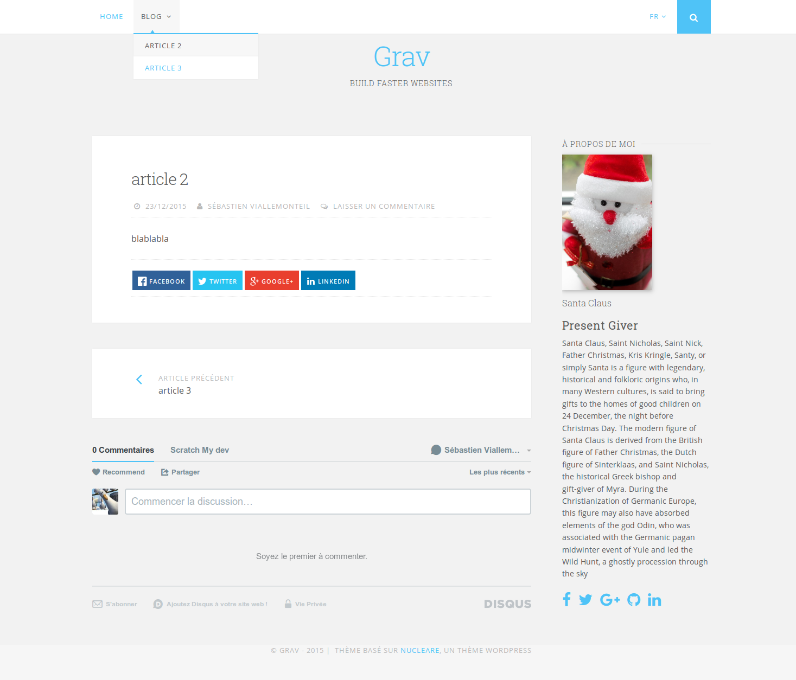

# Nucleare




This template is based on the WordPress theme, named [Nucleare](https://wordpress.com/themes/nucleare/).
It's aimed to be used mainly for blogs, although you can use it with default type pages (Modular templates will comme later).
There might be some problems or features that I forgot, I tried to do my best from what I had with the WordPress theme. If you find something wrong, please open an issue or make a pull request, I'll be glad to look into it. Thanks

## Features

* HTML5 and CSS3
* Lightweight and minimal for optimal performance
* Fully responsive with off-page mobile navigation
* Multiple page template types
* Multi-language support
* Fontawesome icon support
* Customize main colors of the theme (background, links, buttons), look at the blueprints to see the options
* Header image is optional
* Sidebar is disabled by default, you can enable it for all the pages, or enable it individually on the pages you want it to appear. You might want to do it the other way around (enable it by default and disable it on the few pages you don't want it)

### Supported Page Templates (and Plugins)

* Default view template
* Blog view template
* Blog item view template
* Error view template
* Simple search view / partial view
* Breadcrumbs partial view
* Navigation partial view
* Langswitcher partial view within navigation
* Taxonomy list partial view
* Social buttons plugin included in each blog item if enabled. (CSS adapted)
* AboutMe plugin included in the sidebar
* JSComment included in the blog item template if enabled
* Modular view templates:
  * Features Modular: TODO
  * Showcase Modular: TODO
  * Text Modular: TODO
* SnipCart: TODO

### Supported languages
* English
* French
* Romanian
* If you want another language to be supported, please look into the `languages.yaml`, add your language and make a Pull Request

# Installation

Installing the Nucleare theme can be done in one of two ways. Our GPM (Grav Package Manager) installation method enables you to quickly and easily install the theme with a simple terminal command, while the manual method enables you to do so via a zip file. 


## GPM Installation (Preferred)

The simplest way to install this theme is via the [Grav Package Manager (GPM)](http://learn.getgrav.org/advanced/grav-gpm) through your system's Terminal (also called the command line).  From the root of your Grav install type:

    bin/gpm install nucleare

This will install the Nucleare theme into your `/user/themes` directory within Grav. Its files can be found under `/your/site/grav/user/themes/nucleare`.

## Manual Installation

To install this theme, just download the zip version of this repository and unzip it under `/your/site/grav/user/themes`. Then, rename the folder to `nucleare`. You can find these files either on [GitHub](https://github.com/birssan/grav-theme-nucleare) or via [GetGrav.org](http://getgrav.org/downloads/themes).

You should now have all the theme files under

    /your/site/grav/user/themes/nucleare

>> NOTE: This theme is a modular component for Grav which requires the [Grav](http://github.com/getgrav/grav), [Error](https://github.com/getgrav/grav-theme-error) and [Problems](https://github.com/getgrav/grav-plugin-problems) plugins.

# Updating

As development for the Nucleare theme continues, new versions may become available that add additional features and functionality, improve compatibility with newer Grav releases, and generally provide a better user experience. Updating Nucleare is easy, and can be done through Grav's GPM system, as well as manually.

## GPM Update (Preferred)

The simplest way to update this theme is via the [Grav Package Manager (GPM)](http://learn.getgrav.org/advanced/grav-gpm). You can do this with this by navigating to the root directory of your Grav install using your system's Terminal (also called command line) and typing the following:

    bin/gpm update nucleare

This command will check your Grav install to see if your Nucleare theme is due for an update. If a newer release is found, you will be asked whether or not you wish to update. To continue, type `y` and hit enter. The theme will automatically update and clear Grav's cache.

## Manual Update

Manually updating Nucleare is pretty simple. Here is what you will need to do to get this done:

* Delete the `your/site/user/themes/nucleare` directory.
* Download the new version of the Nucleare theme from either [GitHub](https://github.com/birssan/grav-plugin-nucleare) or [GetGrav.org](http://getgrav.org/downloads/themes#extras).
* Unzip the zip file in `your/site/user/themes` and rename the resulting folder to `nucleare`.
* Clear the Grav cache. The simplest way to do this is by going to the root Grav directory in terminal and typing `bin/grav clear-cache`.

> Note: Any changes you have made to any of the files listed under this directory will also be removed and replaced by the new set. Any files located elsewhere (for example a YAML settings file placed in `user/config/themes`) will remain intact.


### Menu Features

##### Dropdown Menu

You can enable **dropdown menu** support by enabling it in the `nucleare.yaml` configuration file. As per usual, copy this file to your `user/config/themes/` folder (create if required) and edit there.

```
dropdown:
  enabled: true
```

This will ensure that sub-pages show up as sub-menus in the navigation.

##### Menu Text & Icons

Each page shows up in the menu using the title by default, however you can set what displays in the menu directly by setting an explicit `menu:` option in the page header:

```
menu: My Menu
```

You can also provide an icon to show up in front of the menu item by providing an `icon:` option.  You need to use name of the FontAwesome icon without the `fa-` prefix.  Check out the full [list of current FontAwesome 4.5 icons](http://fortawesome.github.io/Font-Awesome/icons/):

```
icon: bar-chart-o
```

#### Custom Menu Items

By default, Grav generates the menu from the page structure.  However, there are times when you may want to add custom menu items to the end of the menu.  This is now supported in Nucleare by creating a menu list in your `site.yaml` file.  An example of this is as follows:

```
menu:
    - text: Source
      url: https://github.com/getgrav/grav
    - icon: twitter
      url: http://twitter.com/getgrav
```

The `url:` option is required, but you can provide **either** or **both** `text:` and/or `icon:`

# Setup

If you want to set Nucleare as the default theme, you can do so by following these steps:

* Navigate to `/your/site/grav/user/config`.
* Open the **system.yaml** file.
* Change the `theme:` setting to `theme: nucleare`.
* Save your changes.
* Clear the Grav cache. The simplest way to do this is by going to the root Grav directory in Terminal and typing `bin/grav clear-cache`.

Once this is done, you should be able to see the new theme on the frontend. Keep in mind any customizations made to the previous theme will not be reflected as all of the theme and templating information is now being pulled from the **nucleare** folder.
